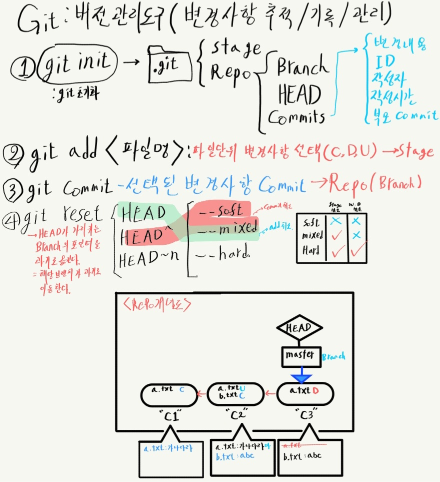

# Git 기본
Git은 개발을 할 때 변경/버전/형상관리에 이용할 수 있는 도구이며 다음의 강점을 가진다.<br>
1. 변경사항의 내역을 보거나 어느 변경사항에서 문제가 발생하였는지 추적할 수 있다.
2. 파일의 변경기록이 남고 추적할 수 있으므로 협업을 용이하게 한다.
3. 같은 파일이 여러 버전이 있을 때 쉽게 비교, 선택이 가능하다.
## 0. Git의 원리
git은 총 3가지 공간을 관리한다: working directory, stage, repositoty.
* working directory는 파일이 편집되는 실제 공간이다. 
* stage는 repository에 적용될 변경사항들이 선택되는 가상 공간이다. 
* repository는 선택된 변경사항들만 적용된 working directory상태를 저장하는 가상공간이다.

변경사항들은 파일단위로 저장되며, 선택된 변경사항들을 repository에 저장할 때는 `commit`이라는 형태로 저장된다. `commit`은 변경내용, 작성자, 작성시간, 이전 commit노드에 대한 정보, ID, commit message 구성된다.

## 1. 설치
[git공식사이트 참조](https://git-scm.com/)

## 2. 초기화: git init
먼저 프로젝트를 진행할 폴더에서 `git bash`를 열거나 터미널을 연다.
이후 `git init`을 입력하면 `.git`폴더가 생성되어 git이 활성화 된다. 이 폴더를 지우면 git이 비활성화된다.

## 3. git add
여러 변경사항 중 commit할 변경사항을 먼저 stage에 올려야한다. `git add <파일명>`를 입력하면 해당 파일의 변경사항(생성,삭제,수정)을 staging한다.

어떤 변경사항들이 stage에 올라갔는지는 `git status`를 통해 알 수 있다.

`add`를 취소하고 싶다면 `git reset HEAD <파일명>`을 사용하면 된다. 파일명 미지정시 전체를 unstage한다.

## 4. git commit ( -m "message" )
`git commit`명령어를 통해 repository에 stage에 올라온 변경사항들을 저장할 수 있다.
commit에는 제목과 내용을 포함한 message를 남겨 어떤 변경사항이 있었는지 표시할 수 있으며 `-m` 옵션을 통해 미리 간략한 메시지를 입력하고 메시지 입력창(vi)이 열리는 것을 막을 수 있다.

commit에는 변경내용이 저장되므로 이전 commit에서 어떤 내용이 수정되었는지 확인할 수 있다. 또한 `git log`를 이용해 commit history를 확인할 수 있다.
## 5. git reset
commit이나 add를 취소하는데 사용한다.
```
git reset HEAD <파일명>
```
: add를 취소한다. 파일명 미지정시 전체 취소.<br>
HEAD는 현재 브랜치의 가장 마지막 커밋을 가리키는 포인터이다. git reset은 이 head가 가리키는 브랜치를 이동시키는 식으로 작동한다.
```
git reset HEAD^
```
: 직전 커밋을 취소한다.
	
	옵션:
	`--soft` : stage와 workingDir 모두 보존
	`--mixed` : stage 취소, workingDir 보존(Default)
	`--hard` : 모두 취소
	`HEAD~2` : 직전 2개의 커밋 취소
더 자세한 동작에 대한 설명은 [공식 사이트](https://git-scm.com/book/ko/v2/Git-%EB%8F%84%EA%B5%AC-Reset-%EB%AA%85%ED%99%95%ED%9E%88-%EC%95%8C%EA%B3%A0-%EA%B0%80%EA%B8%B0)참고.

## 6. 개념도
