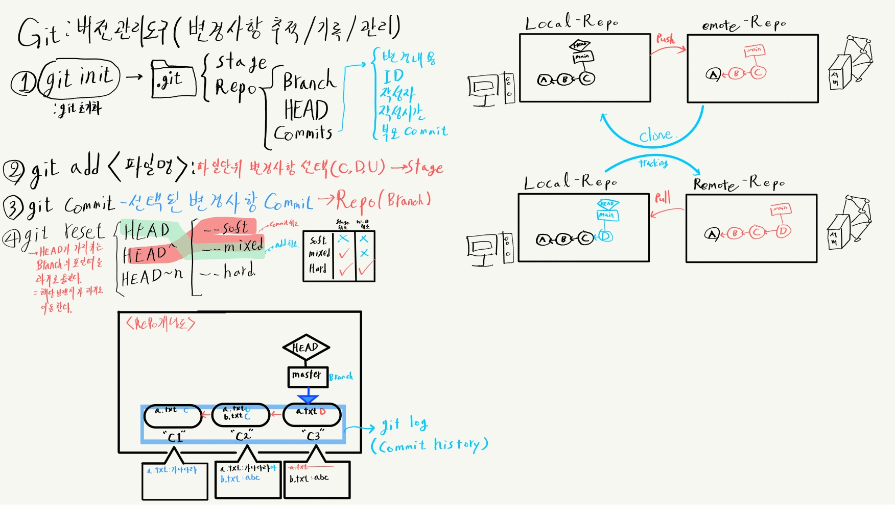

# Git Hub 기본
GitHub은 원격 레포지토리를 제공함으로서, 자신의 프로젝트를 온라인에 공개하고, 여러 사람이 함께 협업할 수 있게 도와주는 서비스이다.

## 1. 원격 레포지토리
원격 레포지토리는 온라인 상에 있는 저장소이다. 따라서 프로젝트를 배포할 수도 있고, 여러 사람이 자신의 로컬레포지토리로 연결하여 협업하는 데 사용할 수 있다.

## 2. tracking / clone
이미 존재하는 나의 로컬 레포지토리 측에서 이미 존재하는 원격레포지토리와 연결하는 것을 tracking이라고한다.<br>
이미 존재하는 원격레포지토리를 새로운 나의 로컬레포지토리로 만드는 것을 clone 이라고 한다.

### 2-1. tracking
1. gitHub에서 빈 레포지토리를 하나 만든다.
2. 해당 레포지토리의 https 주소, 혹은 이미 [SSH키를 등록](https://velog.io/@97ckdtn/%EB%82%B4%EC%9D%BC%EB%B0%B0%EC%9B%80%EC%BA%A0%ED%94%84-03.13-TIL)했다면 SSH주소를 복사한다.
3. 터미널에서 `git remote add origin <주소>`를 입력해 tracking할 원격 레포지토리를 추가한다.
4. `git branch -M main`을 입력해 github설정에 맞게 현재 브랜치(보통 master) main으로 브랜치 이름을 바꾼다.
5. `git push -u origin main`을 입력해 로컬 레포지토리의 내용을 원격에 반영한다.

### 2-2. clone
1. gitHub에서 원격 레포지토리의 https주소를 복사한다.
2. 프로젝트 폴더가 위치하길 원하는 디렉토리에서 터미널에 `git clone <주소>`를 입력한다.

## 3. git push
push는 로컬저장소에 있는 branch의 commit history내용을 원격저장소의 브랜치에 반영한다.
```
git push <원격저장소이름(origin)> <branch이름>
```
 이때 [토큰을 이용한 접근](https://velog.io/@97ckdtn/03.14-TIL)이 필요할 수 있다.<br>
`-u origin <branch명>`옵션을 사용할 경우 로컬저장소의 현재 브랜치와 origin의 브랜치를 자동으로 연결하여 이후로는 `git push`까지만 입력해도 된다.
## 4. git pull
pull은 원격저장소의 branch의 commit history 내용을 로컬저장소의 브랜치에 반영한다.

## 5. 일반적인 순서
Pull → commits... → Push

## 6. git, gitHub 개념도 
